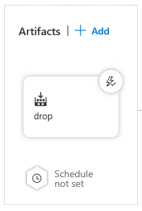
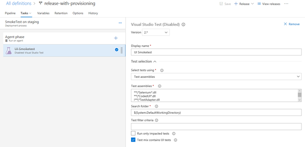
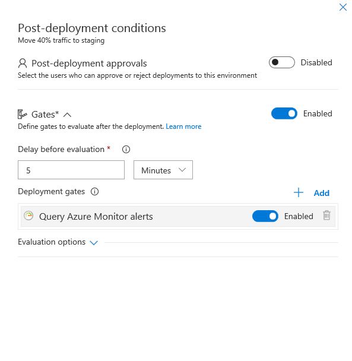

# Prerequisites

To complete the exercises you need to have 
* Your own Visual Studio Team Services Account
* Your own Azure Subscription

# Exercise 0: Getting started
Create a new Team Project in your VSTS subscription. Give it any name you like and create a Git repository that can contain the code we will use in our Exercises.

Clone the repository that can be found here:
* https://github.com/vriesmarcel/FeatureToggles.git

Now push the cloned repository to your just created VSTS project. This can simply be done by adding an additional remote to the Git Repo

``` 
git remote add vsts https://<yourvstsinstance>.visualstudio.com/<yourproject>/_git/<reponame>
git push -u vsts --all
```

Validate that all the code can be viewed in your VSTS account.

## Ensure everyone uses a different database - Alter the Web.config
For this exercise we prepared multiple databases. Coordinate with your meetup host that everyone gets a unique database to connect to. 

**Alter the database connection string in the web.config file to point to that unique database.**

All databases have the same name, with an additional number. User name and password are the same for all databases.
The name of the database is: **MeetupMusicStoreXXX** where XXX is the sequence number.
**Username: ALmeetupUser**
**Password: P2ssw0rd01!@?**


# Exercise 1: Creating a build
Before we can release the software, we need to build it first. For this we create a new CI build using the Standard VSTS visual Studio 2017 hosted Agent pool

* Go to the build tab and create a new build
* Pick the template for ASP.NET web applications

* Point to the git repo you just populated with the MVC Music Store sample that is provided.

* Add an extra step to the build definition to also include any files that can be found in the source control folder called **provisioning**. We will add files to this folder later to provision our Azure resources to run the application.

* Run the build and see if it runs successfully and that you find in the artifact store the zip files that are required to do a web deployment (mvcmusicstore.zip file)

# Exercise 2: Creating a Release pipeline for a canary release
We create a basic release pipeline first that can deploy our application to an Azure webapp.

Go to the Release tab and create a new release. Pick the empty template so we can define everything ourselves

## Add the release artifact
Add an artifact to the release definition. Here we will pick our CI build and we rename the default artifact location to "drop"



## Add the first environment "Provisioning"
For this we need to go to the Azure Portal. Here you create a new Azure Web App, but just before you click create, you click on automation. Here you can download the ARM template ant the parameters required to deploy this resource in Azure. We save the Zipfile to disk and extract it. From the extracted results we only copy the template.json file and the parameters.json file and we place it in the provisioning folder in our local Git repo. We commit the files to the repo and we also push it to the VSTS server.

Since our build already copies these files to the output we can start a new build to get the files in the artifact store. Queue a new build, so we can select the files in the task that we will use in the provisioning environment

The provisioning environment will create the web application resource, ensure that all traffic will go to the production deployment slot, will then create a new deployment slot "staging" and then installs the web application in the staging slot. 

The set of tasks required is shown below:


The following tasks are used:

* Azure Resource group Deployment (Create the web app)
* Azure CLI (Create the deployment slot staging)
  *  The commandline is as follows: 
     ``` 
     az webapp deployment slot create --resource-group <yourresourcegroup> --name <yourappname> --slot staging
     ```

* Azure CLI (Ensure 100% traffic to the production slot)
  * The commandline is as follows:
    ```
    az webapp traffic-routing set -d staging=0 --resource-group <yourresourcegroup> --name <yourappname>
    ```

* Azure Appservice Deploy (install the web application to staging). Use the zipfile that is created in the build and ensure you deploy to the slot with the name "staging"

## Add the second Environment "Smoke test"
In this environment you are going to run a set of UI integration tests to validate if the staging slot is servicing the web application and if the website can show the happy path of your application, buying one product.

For this you add the following tasks to the environment:
* Visual Studio Test
   
  You configure the task so it searches for dll's that have the name codedUI and selenium in it, and you remove any dlls with the name adapter in it.

  For this to work, we do need the test assemblies also as part of our build. Extend the build so you create an extra folder in the artifacts directory and there you copy the test dlls that are part of the solution.
  Also make sure you check that the phase of the task is running on an agent that has the capability to run an interactive session. Also check the checkbox "Test mix contains UI Tests". This ensures the demand for an interactive agent is set when queueing the release.

The final task should look as follows:

## Add the third Environment "10% traffic to staging"
You now know the application is deployed and is working appropriately for the happy flow of your application. Now it is time to release the canary to a selected group of users. For this Exercise we use a random selected group that is 10% of the web traffic that goes to the website.

Create a new environment and call it "10% traffic to staging"

Add the following task:
* Azure CLI
  use the following commandline to set 10% of the  traffic to staging:

  ```
  az webapp traffic-routing set -d staging=10 --resource-group <yourresourcegroup> --name <yourappname>
  ```

After this task is executed, we want to watch the behavior of the website and validate if things still work in a stable and normal fashion. For this we can use release gates.

On the environment we add a release gate. This is done by selecting the post release icon on the environment. Next you enable the release gates option and there you can select Azure Monitoring as an option. Azure monitoring includes application insights. In application insights you can define alert rules. We can e.g. define a rule that the CPU of the web app should not exceed 60%. When you defined this rule, you can then select this rule as the release gate. You can set the evaluation period to e.g. 5 minutes, which implies the gate is checked every 5 minutes. When no alerts are raised in the 5 minutes after the 10% traffic is set, then we can assume the new feature that we deliver does not hamper our server stability and hence we can move to the next stage. the release gate configuration looks as follows:



## Add the fourth Environment "40% traffic to staging"
Here we repeat exactly the same as we did for the previous environment, the only difference is that we define a value of 40 to the azure CLI.
So the commandline needs to be as follows:

  ```
  az webapp traffic-routing set -d staging=40 --resource-group <yourresourcegroup> --name <yourappname>
  ```

  You also set the release gate to be the same as in the previous environment, since we want to move to the final step automatically if no impact is found on our server behavior.


## Add the fifth Environment "Swap slots and 100% to production"
In this final environment, we move all traffic to production again, after we do a so-called VIP swap. A VIP swap means we swap the IP address of the staging and production slots, resulting in all traffic that was served by production now to go to the previously known staging slot. this results in an increase of the traffic to 60%.

Next we set the routing to move all traffic to the production slot. For this we use the azure CLI again. We use the following command line:
```
az webapp traffic-routing set -d staging=0 --resource-group <yourresourcegroup> --name <yourappname>
```

Once we have moved all traffic to production again, we can clean up our deployment slot, saving resources and hence money


The final delivery pipeline should look as follows:


# Exercise 3: Add Feature toggles
In this exercise we add the use of feature toggles to our canary release scenario. the idea is that after we move the traffic to the staging slot, we now want to enable a new feature. The sample application has the ability to enable a feature with a call to a webapi that is part of the website. This API can be called as part of the release pipeline. This way we can release a feature after we validated the new deployment works as it did in the past. 

## Add an Environment "Enable Feature"
Add an extra environment after the 10%. Here we call the WebAPI to enable the feature HomePagefeatureToggle and we set it to true.

The HomePagefeatureToggle has the following properties:

|||
|---|---|
|id | a5144d6f-3e07-47d9-a3b9-6b630ef1a4b5|
|name|HomePagefeatureToggle|

On the homepage of the website you can see the value of the feature toggle:

To enable the feature we use use the task *PowerShell* and use the following inline script:

```powershell
Invoke-WebRequest -Method Put -Uri  http://localhost:26641/api/featuretoggleAPI/a5144d6f-3e07-47d9-a3b9-6b630ef1a4b5?value=false
```
